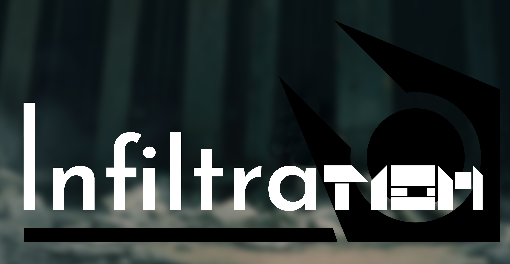
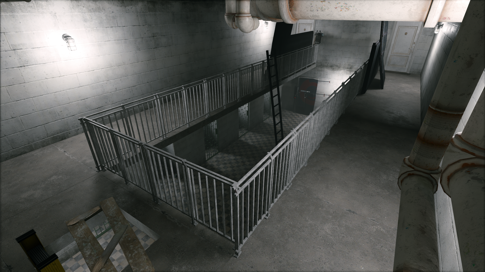
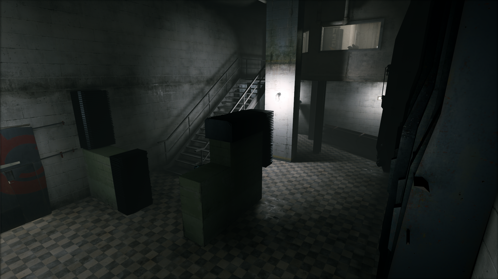
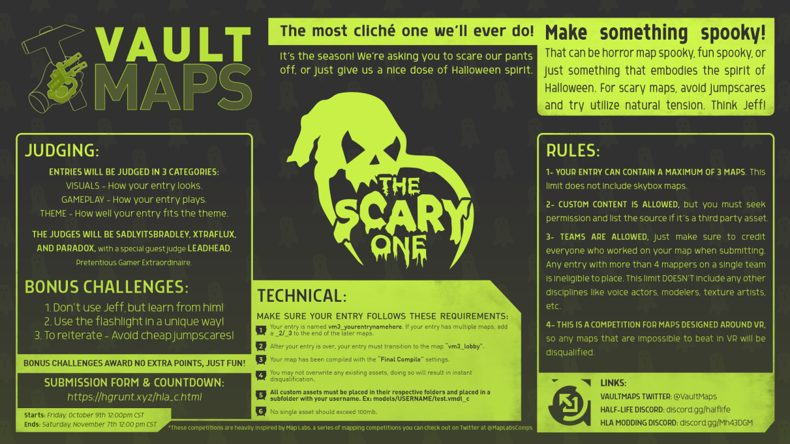

</img>

Caught, in the heart of the Combine Empire, you find yourself deep in enemy lines. But what is the purpose of this facility? Can you survive, with nothing but your wits to defend yourself?

  
  <!--  -->
  

---
## Release
**The latest release of this project can be found on the Steam workshop [here](https://steamcommunity.com/sharedfiles/filedetails/?id=2279547474)**

---
<h4 align="center">This is an entry into the third VaultMap's contest, Horror</h4>

<h4 align="center">A Half-Life: Alyx addon, created by:</h4>

</img>

---

## Credits

> ### Half-Life: 2 Remade Assets
>* **RetroBoy** ([Steam](https://steamcommunity.com/id/0more), [Twitter](https://twitter.com/retroboyart))
>* **Dyna** ([Steam](https://steamcommunity.com/id/dynacorp),  [Twitter](https://twitter.com/npc_dyna))

>### Universal Union Typeface
>* **cubicApocalypse** ([Reddit](https://www.reddit.com/user/cubicApocalypse/))

>### Contest Hosting
>* **Half-Life: Alyx Modding Discord** ([Discord](discord.gg/Mh43DGM))

---

This repository doesn't contain any compiled files, and therefore source code downloads must be compiled before use. The compiled addon is available through the [Steam Workshop](https://steamcommunity.com/sharedfiles/filedetails/?id=2279547474), and will remain hosted there, as the files are too large to be hosted by GitHub. 

</img>

